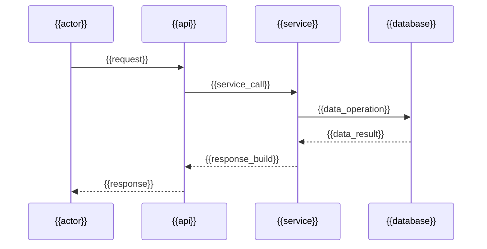

# Technical Specification - Refined v2

## 1. Document Control
- Project Name: `{{project_name}}`
- Jira Project Key: `{{jira_project_key}}`
- Spec Title: `{{spec_title}}`
- Feature Type: `{{feature_type_new_or_enhancement}}`
- Author: `{{author}}`
- Reviewers: `{{reviewers}}`
- Version: `{{version}}`
- Status: `Draft | In Review | Approved`
- Created On: `{{created_on}}`
- Last Updated: `{{updated_on}}`
- Related FDR/BRD/Confluence: `{{source_requirement}}`

## 2. Executive Summary
### 2.1 Problem / Enhancement Overview
`{{problem_overview}}`

### 2.2 Why This Change Is Needed
`{{business_and_technical_justification}}`

### 2.3 Goals
- `{{goal_1}}`
- `{{goal_2}}`
- `{{goal_3}}`

### 2.4 Non-Goals
- `{{non_goal_1}}`
- `{{non_goal_2}}`

## 3. Scope
### 3.1 In Scope
- `{{in_scope_items}}`

### 3.2 Out of Scope
- `{{out_of_scope_items}}`

## 4. Current State (As-Is)
### 4.1 Current Functional Behavior
`{{current_behavior_summary}}`

### 4.2 Current Technical Architecture
`{{current_architecture_summary}}`

### 4.3 Known Gaps / Pain Points
- `{{gap_1}}`
- `{{gap_2}}`

## 5. Proposed Solution (To-Be)
### 5.1 Solution Overview
`{{proposed_solution_overview}}`

### 5.2 Functional Behavior Changes
| Area | Current | Proposed | Notes |
|---|---|---|---|
| `{{area_1}}` | `{{current_1}}` | `{{proposed_1}}` | `{{notes_1}}` |
| `{{area_2}}` | `{{current_2}}` | `{{proposed_2}}` | `{{notes_2}}` |

### 5.3 Technical Design Changes
| Layer | Component | Change Type (Create/Modify/Remove) | Description |
|---|---|---|---|
| API | `{{api_component}}` | `{{change_type}}` | `{{change_description}}` |
| Service | `{{service_component}}` | `{{change_type}}` | `{{change_description}}` |
| Data | `{{data_component}}` | `{{change_type}}` | `{{change_description}}` |
| UI | `{{ui_component}}` | `{{change_type}}` | `{{change_description}}` |

### 5.4 Architecture / Flow Diagram
```mermaid
flowchart TD
    A[{{trigger_event}}] --> B[{{entry_component}}]
    B --> C{{{{decision_point}}}}
    C -->|Yes| D[{{path_yes}}]
    C -->|No| E[{{path_no}}]
    D --> F[{{downstream_1}}]
    E --> F
    F --> G[{{final_state}}]
```

### 5.5 Sequence Diagram (Optional)


## 6. Impact Analysis
### 6.1 Impacted Systems / Areas
| System/Area | Impact Type (Functional/Technical/Operational) | Impact Details |
|---|---|---|
| `{{system_1}}` | `{{impact_type_1}}` | `{{impact_details_1}}` |
| `{{system_2}}` | `{{impact_type_2}}` | `{{impact_details_2}}` |

### 6.2 Impacted Components, Classes, and Methods
| Repository Path | Component/Class | Method/Function | Change Summary | Owner |
|---|---|---|---|---|
| `{{path_1}}` | `{{class_1}}` | `{{method_1}}` | `{{change_summary_1}}` | `{{owner_1}}` |
| `{{path_2}}` | `{{class_2}}` | `{{method_2}}` | `{{change_summary_2}}` | `{{owner_2}}` |

### 6.3 Contract / API Changes
| API/Topic | Change | Backward Compatible | Versioning / Migration Notes |
|---|---|---|---|
| `{{api_or_event_1}}` | `{{contract_change_1}}` | `{{yes_no}}` | `{{migration_notes_1}}` |

### 6.4 Data Model / DB Changes
| Entity/Table | Change | Rollback Strategy | Data Migration Required |
|---|---|---|---|
| `{{entity_1}}` | `{{db_change_1}}` | `{{rollback_1}}` | `{{yes_no}}` |

## 7. Detailed Implementation Plan
### 7.1 Step-by-Step Plan
1. `{{implementation_step_1}}`
2. `{{implementation_step_2}}`
3. `{{implementation_step_3}}`

### 7.2 Code Snippets / Pseudocode for Key Changes
```python
# File: {{file_path}}
# Class: {{class_name}}
# Method: {{method_name}}
def {{method_name}}(...):
    # {{purpose}}
    ...
```

```typescript
// File: {{file_path}}
export function {{function_name}}(...) {
  // {{purpose}}
}
```

### 7.3 Config / Feature Flag / Infra Changes
| Item | Current | Proposed | Required in Environments |
|---|---|---|---|
| `{{config_key}}` | `{{current_value}}` | `{{new_value}}` | `{{envs}}` |

## 8. Assumptions, Dependencies, and Risks
### 8.1 Assumptions
- `{{assumption_1}}`
- `{{assumption_2}}`

### 8.2 Dependencies
- `{{dependency_1}}`
- `{{dependency_2}}`

### 8.3 Risks and Mitigations
| Risk | Probability | Impact | Mitigation | Owner |
|---|---|---|---|---|
| `{{risk_1}}` | `{{low_med_high}}` | `{{low_med_high}}` | `{{mitigation_1}}` | `{{owner_1}}` |

## 9. Testing and QA Plan
### 9.1 Test Strategy
- Unit Tests: `{{unit_test_scope}}`
- Integration Tests: `{{integration_test_scope}}`
- E2E / UAT: `{{e2e_scope}}`
- Regression Focus: `{{regression_scope}}`

### 9.2 Test Scenarios
| ID | Scenario | Type | Expected Result |
|---|---|---|---|
| `TS-01` | `{{scenario_1}}` | `Functional` | `{{expected_1}}` |
| `TS-02` | `{{scenario_2}}` | `Negative` | `{{expected_2}}` |

### 9.3 QA Entry/Exit Criteria
- Entry Criteria:
  - `{{qa_entry_1}}`
  - `{{qa_entry_2}}`
- Exit Criteria:
  - `{{qa_exit_1}}`
  - `{{qa_exit_2}}`

## 10. Release and Rollback Plan
### 10.1 Release Plan
- `{{release_steps}}`

### 10.2 Monitoring and Alerts
- `{{logs_metrics_traces_alerts}}`

### 10.3 Rollback Plan
- `{{rollback_strategy}}`

## 11. Jira Story (Single Story Ready)
### 11.1 Story Draft
- Story Type: `Story`
- Summary: `{{jira_story_summary}}`
- Description:
  - Problem: `{{story_problem}}`
  - Proposed Solution: `{{story_solution}}`
  - Scope: `{{story_scope}}`
  - Dependencies: `{{story_dependencies}}`

### 11.2 Acceptance Criteria (AC)
1. Given `{{precondition_1}}`, when `{{action_1}}`, then `{{outcome_1}}`.
2. Given `{{precondition_2}}`, when `{{action_2}}`, then `{{outcome_2}}`.
3. Given `{{precondition_3}}`, when `{{action_3}}`, then `{{outcome_3}}`.
4. Negative case: Given `{{invalid_condition}}`, when `{{action}}`, then `{{error_or_fallback}}`.
5. Observability: Logs/metrics include `{{observability_requirements}}`.

## 12. Open Questions
- `{{open_question_1}}`
- `{{open_question_2}}`

## 13. Sign-Off
- Engineering: `{{eng_signoff}}`
- QA: `{{qa_signoff}}`
- Product: `{{product_signoff}}`
- Architecture: `{{arch_signoff}}`
